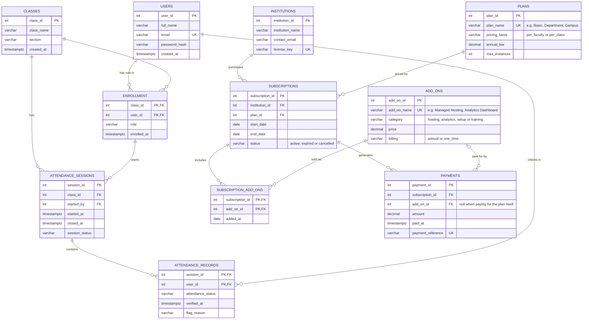

```mermaid
erDiagram
    USERS {
        int user_id PK
        varchar full_name
        varchar email UK
        varchar password_hash 
        timestamptz created_at
    }

    CLASSES {
        int class_id PK
        varchar class_name
        varchar section
        timestamptz created_at
    }

    ENROLLMENT {
        int class_id PK, FK
        int user_id PK, FK
        varchar role 
        timestamptz enrolled_at
    }

    ATTENDANCE_SESSIONS {
        int session_id PK
        int class_id FK
        int started_by FK
        timestamptz started_at
        timestamptz closed_at
        varchar session_status 
        %% below this can be done api side
        %%varchar code
        %%timestamptz code_expires_at 
        %%decimal latitude 
        %%decimal longitude 
    }

    ATTENDANCE_RECORDS {
        int session_id PK, FK
        int user_id PK, FK
        varchar attendance_status 
        timestamptz verified_at
        %% same here, i don't think we want to store students location
        %%decimal latitude 
        %%decimal longitude 
        %%decimal accuracy_m 
        varchar flag_reason 
    }

    INSTITUTIONS {
        int institution_id PK
        varchar institution_name
        varchar contact_email
        varchar license_key UK
    }

    PLANS {
        int plan_id PK
        varchar plan_name UK "e.g. Basic, Department, Campus"
        varchar pricing_basis "per_faculty or per_class"
        decimal annual_fee
        int max_instances
    }

    SUBSCRIPTIONS {
        int subscription_id PK
        int institution_id FK
        int plan_id FK
        date start_date
        date end_date
        varchar status "active, expired or cancelled"
    }

    ADD_ONS {
        int add_on_id PK
        varchar add_on_name UK "e.g. Managed Hosting, Analytics Dashboard"
        varchar category "hosting, analytics, setup or training"
        decimal price
        varchar billing "annual or one_time"
    }

    SUBSCRIPTION_ADD_ONS {
        int subscription_id PK, FK
        int add_on_id PK, FK
        date added_at
    }

    PAYMENTS {
        int payment_id PK
        int subscription_id FK
        int add_on_id FK "null when paying for the plan itself"
        decimal amount
        timestamptz paid_at
        varchar payment_reference UK
    }

    USERS ||--o{ ENROLLMENT : "has role in"
    CLASSES ||--o{ ENROLLMENT : "includes"
    CLASSES ||--o{ ATTENDANCE_SESSIONS : "has"
    ENROLLMENT ||--o{ ATTENDANCE_SESSIONS : "starts"
    ATTENDANCE_SESSIONS ||--o{ ATTENDANCE_RECORDS : "contains"
    USERS ||--o{ ATTENDANCE_RECORDS : "checks in"
    INSTITUTIONS ||--o{ SUBSCRIPTIONS : "purchases"
    PLANS ||--o{ SUBSCRIPTIONS : "priced by"
    SUBSCRIPTIONS ||--o{ SUBSCRIPTION_ADD_ONS : "includes"
    ADD_ONS ||--o{ SUBSCRIPTION_ADD_ONS : "sold as"
    SUBSCRIPTIONS ||--o{ PAYMENTS : "generates"
    ADD_ONS |o--o{ PAYMENTS : "paid for by"
```