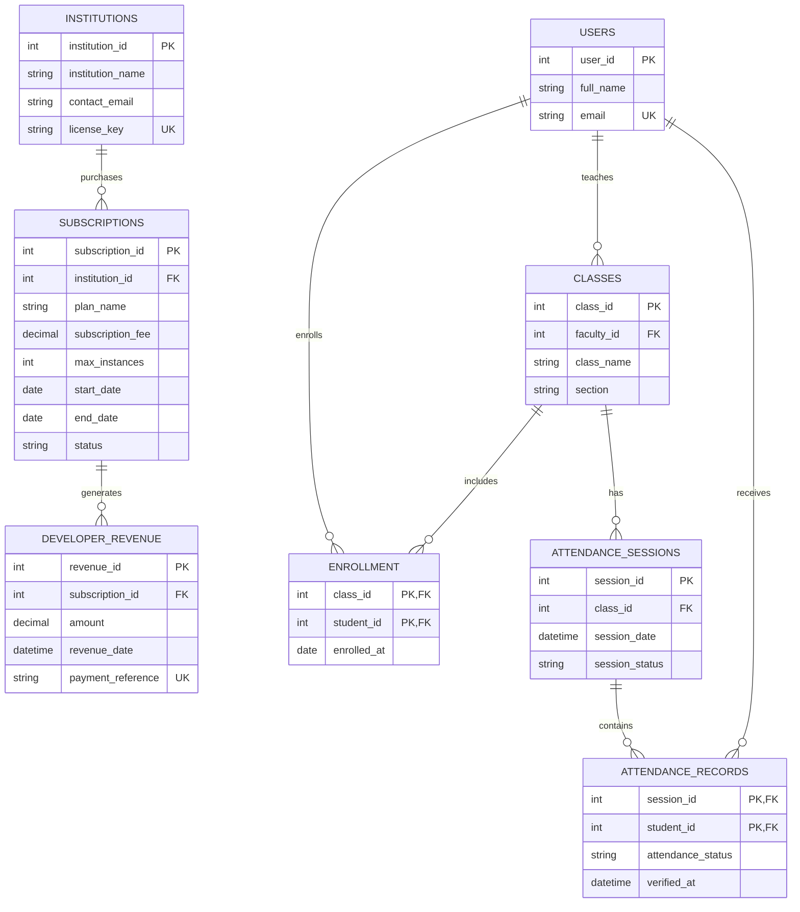

```mermaid
erDiagram
    INSTITUTIONS ||--o{ SUBSCRIPTIONS : purchases
    SUBSCRIPTIONS ||--o{ DEVELOPER_REVENUE : generates
    USERS ||--o{ CLASSES : teaches
    USERS ||--o{ ENROLLMENT : enrolls
    CLASSES ||--o{ ENROLLMENT : includes
    CLASSES ||--o{ ATTENDANCE_SESSIONS : has
    ATTENDANCE_SESSIONS ||--o{ ATTENDANCE_RECORDS : contains
    USERS ||--o{ ATTENDANCE_RECORDS : receives

    INSTITUTIONS {
        int institution_id PK
        string institution_name
        string contact_email
        string license_key UK
    }
    SUBSCRIPTIONS {
        int subscription_id PK
        int institution_id FK
        string plan_name
        decimal subscription_fee
        int max_instances
        date start_date
        date end_date
        string status
    }
    DEVELOPER_REVENUE {
        int revenue_id PK
        int subscription_id FK
        decimal amount
        datetime revenue_date
        string payment_reference UK
    }

    USERS {
        int user_id PK
        string full_name
        string email UK
    }
    CLASSES {
        int class_id PK
        int faculty_id FK
        string class_name
        string section
    }
    ENROLLMENT {
        int class_id PK,FK
        int student_id PK,FK
        date enrolled_at
    }
    ATTENDANCE_SESSIONS {
        int session_id PK
        int class_id FK
        datetime session_date
        string session_status
    }
    ATTENDANCE_RECORDS {
        int session_id PK,FK
        int student_id PK,FK
        string attendance_status
        datetime verified_at
    }
```